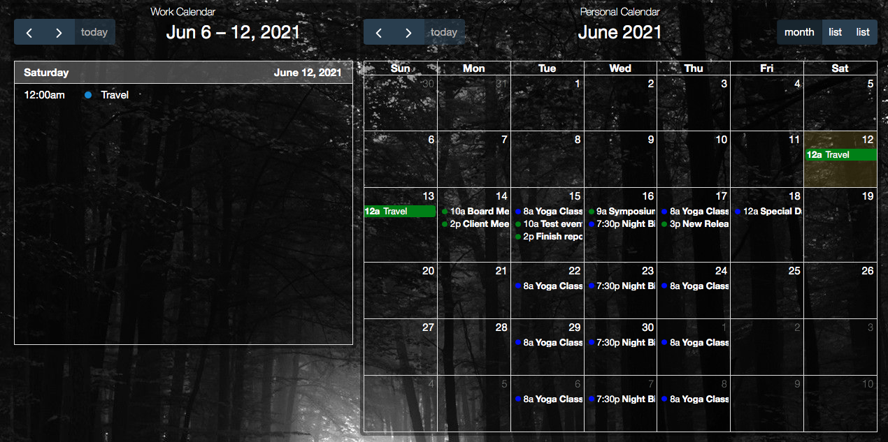

# hadashboard-calendar-widget

This is my attempt to create a calendar widget for hadasboard. To be true
it's kind of a [fullcalendar.io](https://fullcalendar.io) library wrapped on a widget.

## Install

To use the widget you will need a running appdaemon version 4.0.8 or later. To
install the widget do:

1. Start by creating the "custom_javascript" folder inside appdaemon main configuration folder,
and copying the fullcalendar.js file to it.
2. Copy the contents of custom_widget to the custom_widget folder of the appdaemon
3. Copy the contents of apps to the apps folder of the appdaemon.

## Configuration

The widget expects to find the calendar events on the "json" attribute of a sensor, so use the
calendar app to create a sensor. (see ["calendar app"](/apps/calendar/README.md)).

The calendar widget can be configured using a simple configuration mode or a complex one. To
configure it using the simple mode just set the entity and view attributes, like the following
example:

```yaml
calendar:
    widget_type: calendar
    title: "Work Calendar"
    entity: sensor.cal_test1
    view: "listWeek"
```
The view attribute can be one of the following: dayGridDay, dayGridWeek, dayGridMonth, timeGridDay, 
timeGridWeek, listDay,listWeek, listMonth.

Or you could take total control and use all the valid options of the [fullcalendar](https://fullcalendar.io/docs) library and pass
then using the "fullcalendar_options". You may also use more than one calendar and set custom colors
for each one by setting the "entities" option instead of the "entity". Example:

```yaml
calendar2:
    widget_type: calendar
    title: "Personal Calendar"
    entities:
        sensor.cal_test1: 
           color: 'green'
        sensor.cal_test2:
            color: 'blue'
    fullcalendar_options:
        displayEventTime: 'true'
        height: "100%"
        initialView: 'dayGridMonth'
        headerToolbar: 
          start: 'prev,next,today'
          center: 'title'
          end: 'dayGridMonth,listDay,listWeek'
```

The following screenshot shows the result of the previous configurations.




